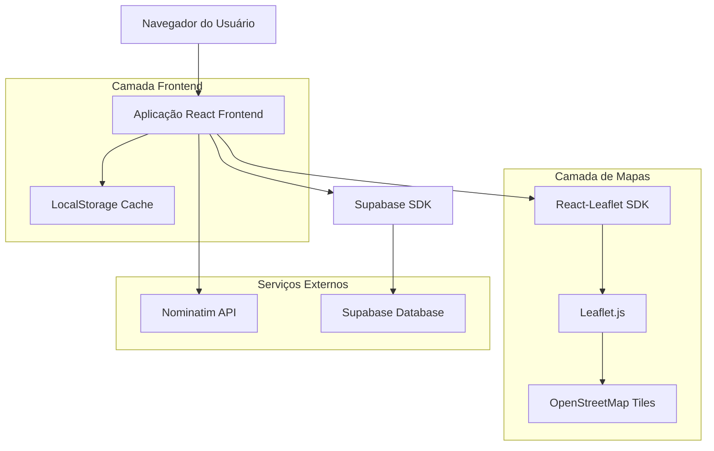
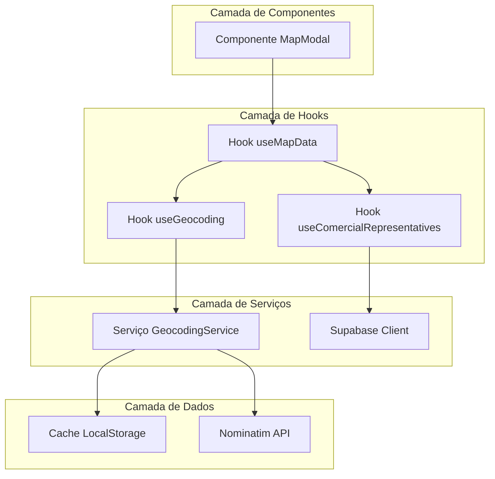
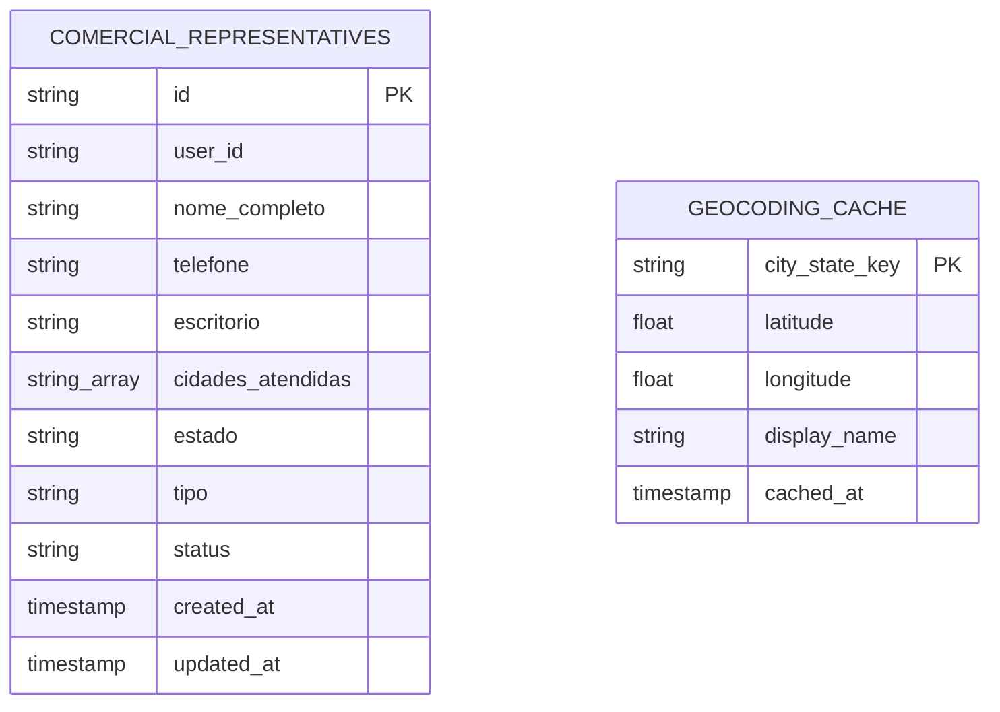

# Documento de Arquitetura Técnica - Mapa Comercial

## 1. Design da Arquitetura



## 2. Descrição das Tecnologias

* Frontend: React\@18 + TypeScript + Tailwind CSS + Vite

* Mapas: React-Leaflet\@4 + Leaflet\@1.9

* Geocodificação: Nominatim API (gratuita)

* Backend: Supabase (dados dos representantes)

* Cache: LocalStorage (coordenadas geocodificadas)

## 3. Definições de Rotas

| Rota             | Propósito                                             |
| ---------------- | ----------------------------------------------------- |
| /comercial       | Página principal do módulo comercial com botão "Mapa" |
| Modal (não rota) | Modal sobreposto com mapa interativo                  |

## 4. Definições de API

### 4.1 APIs Principais

**Nominatim Geocoding API**

```
GET https://nominatim.openstreetmap.org/search
```

Request:

| Nome do Parâmetro | Tipo   | Obrigatório | Descrição                                          |
| ----------------- | ------ | ----------- | -------------------------------------------------- |
| q                 | string | true        | Query de busca no formato "cidade, estado, Brasil" |
| format            | string | true        | Formato da resposta (json)                         |
| limit             | number | true        | Limite de resultados (1)                           |
| countrycodes      | string | true        | Código do país (br)                                |

Response:

| Nome do Parâmetro | Tipo   | Descrição                    |
| ----------------- | ------ | ---------------------------- |
| lat               | string | Latitude da localização      |
| lon               | string | Longitude da localização     |
| display\_name     | string | Nome completo da localização |

Exemplo:

```json
[
  {
    "lat": "-23.5505199",
    "lon": "-46.6333094",
    "display_name": "São Paulo, Região Sudeste, Brasil"
  }
]
```

**Supabase - Representantes Comerciais**

```
SELECT * FROM comercial_representatives WHERE status = 'ativo'
```

Response:

| Nome do Parâmetro  | Tipo      | Descrição                         |
| ------------------ | --------- | --------------------------------- |
| id                 | string    | ID único do representante         |
| nome\_completo     | string    | Nome completo                     |
| telefone           | string    | Telefone para contato             |
| escritorio         | string    | Nome do escritório                |
| cidades\_atendidas | string\[] | Array de cidades atendidas        |
| estado             | string    | Estado de atuação                 |
| tipo               | string    | Tipo: 'representante' ou 'broker' |
| status             | string    | Status: 'ativo' ou 'inativo'      |

## 5. Diagrama da Arquitetura do Servidor



## 6. Modelo de Dados

### 6.1 Definição do Modelo de Dados



### 6.2 Linguagem de Definição de Dados

**Estrutura TypeScript para Geocodificação**

```typescript
// Tipos para geocodificação
interface GeocodingResult {
  lat: string;
  lon: string;
  display_name: string;
}

interface CachedCoordinate {
  latitude: number;
  longitude: number;
  display_name: string;
  cached_at: string;
}

interface MapPin {
  id: string;
  latitude: number;
  longitude: number;
  city: string;
  state: string;
  representatives: ComercialRepresentative[];
}

// Serviço de Geocodificação
class GeocodingService {
  private static readonly CACHE_KEY = 'geocoding_cache';
  private static readonly CACHE_EXPIRY_DAYS = 30;
  
  static async getCoordinates(city: string, state: string): Promise<CachedCoordinate | null> {
    const cacheKey = `${city.toLowerCase()}_${state.toLowerCase()}`;
    
    // Verificar cache local
    const cached = this.getCachedCoordinate(cacheKey);
    if (cached && !this.isCacheExpired(cached.cached_at)) {
      return cached;
    }
    
    // Buscar na API Nominatim
    try {
      const query = `${city}, ${state}, Brasil`;
      const response = await fetch(
        `https://nominatim.openstreetmap.org/search?q=${encodeURIComponent(query)}&format=json&limit=1&countrycodes=br`
      );
      
      const data: GeocodingResult[] = await response.json();
      
      if (data.length > 0) {
        const result = data[0];
        const coordinate: CachedCoordinate = {
          latitude: parseFloat(result.lat),
          longitude: parseFloat(result.lon),
          display_name: result.display_name,
          cached_at: new Date().toISOString()
        };
        
        // Salvar no cache
        this.setCachedCoordinate(cacheKey, coordinate);
        return coordinate;
      }
    } catch (error) {
      console.error('Erro na geocodificação:', error);
    }
    
    return null;
  }
  
  private static getCachedCoordinate(key: string): CachedCoordinate | null {
    try {
      const cache = localStorage.getItem(this.CACHE_KEY);
      if (cache) {
        const parsed = JSON.parse(cache);
        return parsed[key] || null;
      }
    } catch (error) {
      console.error('Erro ao ler cache:', error);
    }
    return null;
  }
  
  private static setCachedCoordinate(key: string, coordinate: CachedCoordinate): void {
    try {
      const cache = localStorage.getItem(this.CACHE_KEY);
      const parsed = cache ? JSON.parse(cache) : {};
      parsed[key] = coordinate;
      localStorage.setItem(this.CACHE_KEY, JSON.stringify(parsed));
    } catch (error) {
      console.error('Erro ao salvar cache:', error);
    }
  }
  
  private static isCacheExpired(cachedAt: string): boolean {
    const cacheDate = new Date(cachedAt);
    const expiryDate = new Date();
    expiryDate.setDate(expiryDate.getDate() - this.CACHE_EXPIRY_DAYS);
    return cacheDate < expiryDate;
  }
}

// Hook customizado para dados do mapa
function useMapData() {
  const { representatives } = useComercialRepresentatives();
  const [mapPins, setMapPins] = useState<MapPin[]>([]);
  const [isLoading, setIsLoading] = useState(false);
  
  useEffect(() => {
    async function loadMapData() {
      if (representatives.length === 0) return;
      
      setIsLoading(true);
      
      // Agrupar representantes por cidade/estado
      const cityGroups = new Map<string, {
        city: string;
        state: string;
        representatives: ComercialRepresentative[];
      }>();
      
      representatives.forEach(rep => {
        if (rep.status === 'ativo' && rep.cidades_atendidas.length > 0) {
          rep.cidades_atendidas.forEach(city => {
            const key = `${city}_${rep.estado}`;
            if (!cityGroups.has(key)) {
              cityGroups.set(key, {
                city,
                state: rep.estado || '',
                representatives: []
              });
            }
            cityGroups.get(key)!.representatives.push(rep);
          });
        }
      });
      
      // Geocodificar cada cidade
      const pins: MapPin[] = [];
      
      for (const [key, group] of cityGroups) {
        const coordinates = await GeocodingService.getCoordinates(group.city, group.state);
        
        if (coordinates) {
          pins.push({
            id: key,
            latitude: coordinates.latitude,
            longitude: coordinates.longitude,
            city: group.city,
            state: group.state,
            representatives: group.representatives
          });
        }
        
        // Delay para respeitar rate limit da API
        await new Promise(resolve => setTimeout(resolve, 1000));
      }
      
      setMapPins(pins);
      setIsLoading(false);
    }
    
    loadMapData();
  }, [representatives]);
  
  return { mapPins, isLoading };
}
```

**Dependências do package.json**

```json
{
  "dependencies": {
    "leaflet": "^1.9.4",
    "react-leaflet": "^4.2.1"
  },
  "devDependencies": {
    "@types/leaflet": "^1.9.8"
  }
}
```

**Configuração de CSS para Leaflet**

```css
/* Adicionar ao index.css ou arquivo CSS principal */
@import 'leaflet/dist/leaflet.css';

.leaflet-container {
  height: 100%;
  width: 100%;
  z-index: 1;
}

.map-modal {
  z-index: 9999;
}

.map-modal .leaflet-container {
  border-radius: 8px;
}
```

