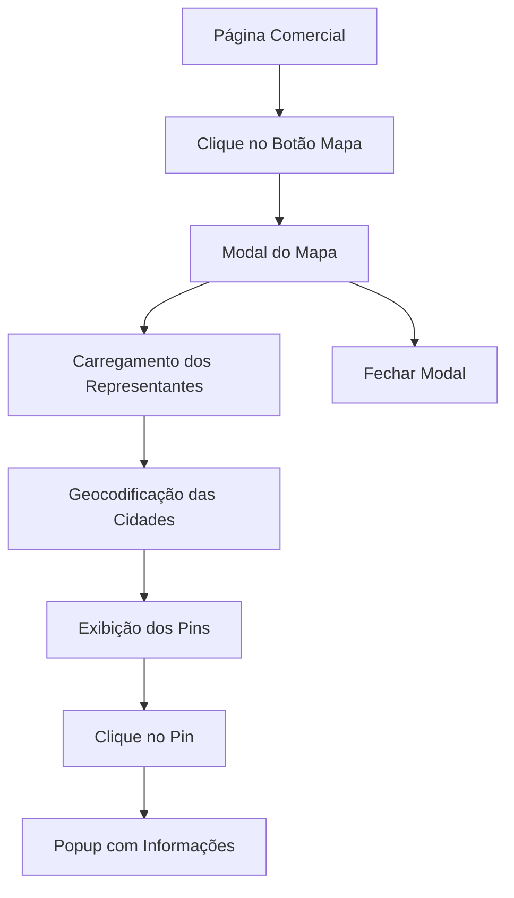

# Documento de Requisitos do Produto - Mapa Comercial

## 1. Visão Geral do Produto

Implementação de funcionalidade de mapa interativo no módulo comercial para visualização geográfica dos representantes e brokers cadastrados. O sistema permitirá aos usuários visualizar a distribuição territorial dos representantes através de um mapa do Brasil com pins de localização, facilitando a análise de cobertura geográfica e tomada de decisões estratégicas.

## 2. Funcionalidades Principais

### 2.1 Papéis de Usuário

| Papel | Método de Acesso | Permissões Principais |
|-------|------------------|----------------------|
| Usuário Autenticado | Login no sistema | Pode visualizar o mapa e informações dos representantes |
| Administrador | Login com privilégios admin | Acesso completo ao mapa e dados dos representantes |

### 2.2 Módulo de Funcionalidades

Nossos requisitos do mapa comercial consistem nas seguintes páginas principais:

1. **Página Comercial**: botão "Mapa" ao lado do "Novo Cadastro", modal de mapa interativo.
2. **Modal do Mapa**: visualização do mapa do Brasil, pins de localização, popup de informações.
3. **Sistema de Geocodificação**: conversão de cidades em coordenadas, cache local de coordenadas.

### 2.3 Detalhes das Páginas

| Nome da Página | Nome do Módulo | Descrição da Funcionalidade |
|----------------|----------------|-----------------------------|
| Página Comercial | Botão Mapa | Adicionar botão "Mapa" ao lado do botão "Novo Cadastro" que abre modal com mapa |
| Modal do Mapa | Container do Mapa | Exibir mapa do Brasil centralizado usando Leaflet e OpenStreetMap |
| Modal do Mapa | Pins de Localização | Mostrar pins em cada cidade onde representantes atuam baseado em cidades_atendidas + estado |
| Modal do Mapa | Popup de Informações | Exibir detalhes do representante ao clicar no pin (nome, telefone, escritório, tipo) |
| Sistema de Geocodificação | API Nominatim | Converter nome da cidade + estado em coordenadas latitude/longitude |
| Sistema de Geocodificação | Cache Local | Armazenar coordenadas no localStorage para evitar requisições repetidas |
| Modal do Mapa | Controles do Mapa | Zoom, pan, botão de fechar modal |

## 3. Processo Principal

**Fluxo do Usuário:**

1. Usuário acessa a página do Módulo Comercial
2. Usuário clica no botão "Mapa" ao lado de "Novo Cadastro"
3. Sistema abre modal com mapa do Brasil
4. Sistema busca todos os representantes ativos
5. Para cada cidade única dos representantes:
   - Verifica se coordenadas estão no cache local
   - Se não estiver, faz requisição para API Nominatim
   - Armazena coordenadas no cache
   - Adiciona pin no mapa
6. Usuário pode clicar em qualquer pin para ver informações do representante
7. Usuário pode fechar o modal clicando no botão fechar ou fora do modal

## 4. Design da Interface do Usuário

### 4.1 Estilo de Design

- **Cores primárias e secundárias**: Manter paleta existente do sistema (azul primário, cinza secundário)
- **Estilo dos botões**: Botão "Mapa" com ícone de mapa, estilo consistente com "Novo Cadastro"
- **Fonte e tamanhos**: Manter tipografia existente do sistema
- **Estilo do layout**: Modal centralizado, mapa ocupando 80% da tela, controles intuitivos
- **Ícones**: Usar ícones do Lucide React (Map, MapPin, X para fechar)

### 4.2 Visão Geral do Design das Páginas

| Nome da Página | Nome do Módulo | Elementos da UI |
|----------------|----------------|----------------|
| Página Comercial | Botão Mapa | Botão com ícone de mapa, posicionado ao lado do "Novo Cadastro", cor primária |
| Modal do Mapa | Container | Modal responsivo 90% largura/altura, fundo escuro semi-transparente, z-index alto |
| Modal do Mapa | Mapa Leaflet | Mapa ocupando toda área do modal, tiles OpenStreetMap, controles de zoom |
| Modal do Mapa | Pins Customizados | Pins coloridos por tipo (azul para representantes, verde para brokers) |
| Modal do Mapa | Popup | Card com informações: nome, telefone, escritório, cidades atendidas, botão WhatsApp |
| Modal do Mapa | Botão Fechar | Ícone X no canto superior direito, hover effect |

### 4.3 Responsividade

O produto é desktop-first com adaptação mobile. Em dispositivos móveis, o modal ocupará 95% da tela e os controles serão otimizados para toque.
